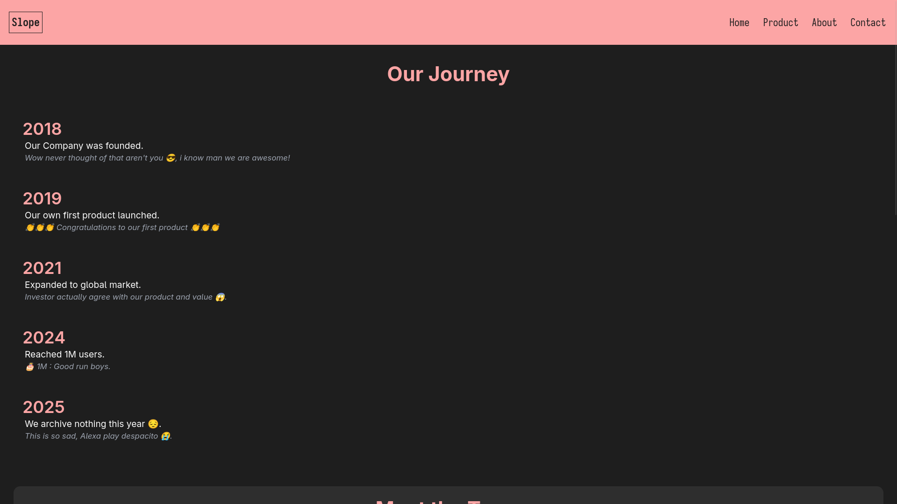

# UAS PPPL

## Accessible Route

1. `/`
2. `/services`
3. `/about`
4. `/contact`
5. `/portofolio`

## Usage

1. Install Typescript compiler (if Installed globally then no need)

```sh
npm install
```

2. Compile Typescript file

```sh
npx tsc
```

3. Run the server

```sh
npx serve -s .
```

## Screenshots




